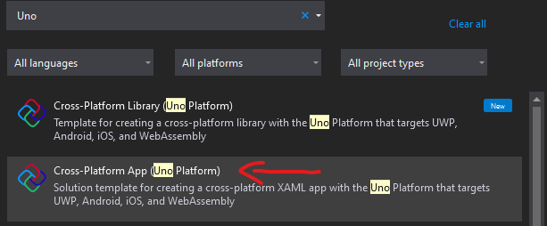
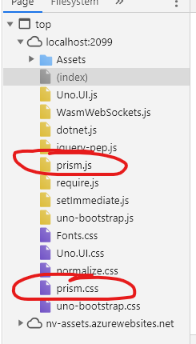
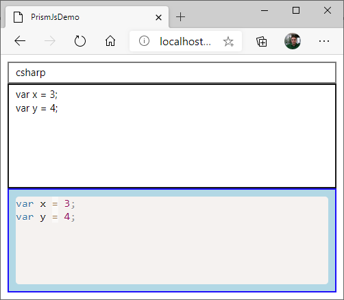
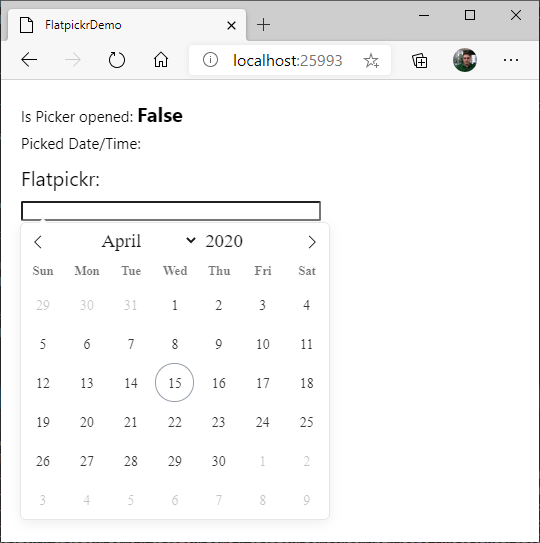

# Embedding Existing Javascript Components Into Uno-WASM

Uno fully embraces HTML5 as its display backend on its WASM target. As a result, it's possible to integrate with almost any existing JavaScript library to extend the behavior of an app.

This article will first review how Uno interoperates with HTML5, followed by a fully-worked example integration of a simple JavaScript-based syntax highlighter in an Uno project. In a future article we will go further and deeper into the .NET/JavaScript interop.

# Uno Wasm Bootstrap - where it starts

Behind a Uno-Wasm project, there's a component called [`Uno.Wasm.Bootstrap`](https://github.com/unoplatform/Uno.Wasm.Bootstrap). It contains the tooling required to build, package, deploy and run a _.NET_ project in a web browser using _WebAssembly_. It's automatically included in any Uno application created from the templates.

## Embedding assets

In the HTML world, everything running in the browser are assets that must be downloaded from a server. To integrate existing JavaScript frameworks, you can either download those directly from the Internet (usually from a CDN service) or embed them with your app.

The Uno Bootstrapper can automatically embed any asset and deploy them with the app. Some of them (CSS & JavaScript) can also be loaded with the app. Here's how to declare them in a _Uno Wasm_ project:

1. **JavaScript files** should be in `WasmScripts`  folder: they will be copied to output folder and loaded automatically by the bootstrapper when the page loads. **They must be marked with the `EmbeddedResources` build action**.

2. **CSS Style files** should be in the `WasmCSS` folder: they will be copied to output folder and referenced in the _HTML head_ of the application. **They must be marked with the `EmbeddedResources` build action**.

3. **Asset files** should be marked with the `Content` build action in the app. The file will be copied to output folder and will preserve the same relative path.

4. Alternatively, **any kind of asset files** can be placed directly in the `wwwroot` folder as you would do with any standard ASP.NET Core project. They will be deployed with the app, but the application code will have the responsibility to fetch and use them.

   > **Is it an Aspnet Core project?**
   > No, but it shares a common structure. Some of the deployment features, like the `wwwroot` folder, the VisualStudio integration for running and debugging are reused in a similar way to an ASP.NET Core project. The C# code put in such project will run in the browser, using the .NET runtime. There is no need for a server side component in such a project.

## Uno-Wasm controls are actually HTML5 elements

The [philosophy of Uno](https://platform.uno/docs/articles/concepts/overview/philosophy-of-uno.html) is to rely on native platforms where it makes sense. In the context of a browser, that's the HTML5 DOM. It means each time you're creating an instance of a class deriving from `UIElement`, you're actually creating a HTML element.

That also means that it is possible to control how this element is created.  By default it is a `<div>`, but it can be changed in the constructor by providing the `htmlTag` parameter to the one required. For example:

``` csharp
// MyControl constructors
public MyControl() : base() // will create a "div" HTML element
public MyControl() : base("input") // Will create an "input" HTML element
public MyControl() : base(htmlTag: "span") // Will create a "span" HTML element
```

Once created, it's possible to interact directly with this element by calling helper methods supplied by Uno on base classes. Obviously those methods are only available when targeting the _Wasm_ platform. (You can use [conditional code](https://platform.uno/docs/articles/platform-specific-csharp.html) to use these methods in a multi-platform project.)

Here is a list of helper methods used to facilitate the integration with the HTML DOM:

* The method `base.SetStyle()` can be used to set a CSS Style on the html element. Example:

  ``` csharp
  // Setting only one CSS style
  SetStyle("text-shadow", "2px 2px red");
  
  // Setting many CSS styles at once using C# tuples
  SetStyle(("text-shadow", "2px 2px blue"), ("color", "var(--app-bg-color)"));
  ```

* The method `base.ResetStyle()` can be used to set CSS styles to their default values. Example:

  ``` csharp
  // Reset text-shadow style to its default value
  ResetStyle("text-shadow");
  
  // Reset both text-shadow and color to their default values
  ResetStyle("text-shadow", "color");
  ```

* The `base.SetAttribute()` and `base.RemoteAttribute()` methods can be used to set HTML attributes on the element:

  ``` csharp
  // Set the "href" attribute of an <a> element
  SetAttribute("href", "#section2");
  
  // Set many attributes at once
  SetAttribute(("target", "_blank"), ("referrerpolicy", "no-referrer"));
  
  // Remove attribute from DOM element
  RemoveAttribute("href");
  ```

* The method `base.SetHtmlContent()` can be used to set arbitrary HTML content as child of the control.

  ``` csharp
  SetHtmlContent("<h2>Welcome to Uno Platform!</h2>");
  ```

  > Note: don't use this unless your control doesn't include any managed children. Doing so can result in inconsistent runtime errors.

* Finally, it is possible to invoke an arbitrary piece of JavaScript code by using the static method `WebAssembleRuntime.InvokeJS()`. The script is directly executed in the context of the browser, giving the ability to perform anything that Javascript can do. It is possible to use the `HtmlId` property of the element to locate it in JavaScript code.
  If the control has been loaded (after the `Loaded` event has been raised), it will be available directly by calling `document.getElementById()`. But it's also possible to access it before that by using the  `Uno.UI.WindowManager.current.getView(<HtmlId>)` function in JavaScript.

To illustrate how it is possible to use this in a real application, let's create one to integrate a pretty simple Syntax Highlighter named [`PrismJS`](https://prismjs.com/).

# Integration of PrismJS in a project

## 0. Before starting

📝 To reproduce the code in this article, you must [prepare your development environment using our Getting Started article](https://platform.uno/docs/articles/get-started.html).

## 1. Create the projects

🎯 This section is very similar to the [_Getting Started_ tutorial in the official documentation](https://platform.uno/docs/articles/getting-started-tutorial-1.html).

1. Start **Visual Studio 2019**
2. Click `Create a new project`
   
3. **Search for "Uno"** and pick `Cross-Platform App (Uno Platform)`.
   
   Select it and click `Next`.
4. Give a project name and folder as you wish. It will be named `PrismJsDemo` here.
5. Click `Create` button.
6. Delete the `.Droid`, `.iOS` and `.UWP` projects.
   
   > Note: it is possible to build multi-platforms controls, but it's the goal of another article. Removing them will avoid misleading compilation errors for now.
7. Right-click on the solution and pick `Manage NuGet Packages for Solution...`
   
8. Update to latest version of `Uno` dependencies. **DO NOT UPDATE THE `Microsoft.Extensions.Logging` dependencies** to latest versions.
9. Press `CTRL-F5`. App should compile and start a browser session showing this:
   
   Note: if it is the first time you're using the Uno platform, it could take some times to download the latest .NET for WebAssembly SDK into a temporary folder.

## 2. Create a control in managed code

🎯 In this section, a control named `PrismJsView` is created in code and used in the XAML page (`MainPage.xaml`) to present it.

1. From the `.Shared` project, create a new class file named `PrismJsView.cs`. and copy the following code:

   ```csharp
   using System;
   using System.Collections.Generic;
   using System.Text;
   using Windows.UI.Xaml;
   using Windows.UI.Xaml.Controls;
   using Windows.UI.Xaml.Markup;
   using Uno.Foundation;
   
   namespace PrismJsDemo.Shared
   {
       [ContentProperty(Name = "Code")]
       public class PrismJsView : Control
       {
           // *************************
           // * Dependency Properties *
           // *************************
   
           public static readonly DependencyProperty CodeProperty = DependencyProperty.Register(
               "Code",
               typeof(string),
               typeof(PrismJsView),
               new PropertyMetadata(default(string), CodeChanged));
   
           public string Code
           {
               get => (string)GetValue(CodeProperty);
               set => SetValue(CodeProperty, value);
           }
   
           public static readonly DependencyProperty LanguageProperty = DependencyProperty.Register(
               "Language",
               typeof(string),
               typeof(PrismJsView),
               new PropertyMetadata(default(string), LanguageChanged));
   
           public string Language
           {
               get => (string)GetValue(LanguageProperty);
               set => SetValue(LanguageProperty, value);
           }
   
           // ***************
           // * Constructor *
           // ***************
   
           public PrismJsView() : base("code") // PrismJS requires a <code> element
           {
               // Any HTML initialization here
           }
   
           // ******************************
           // * Property Changed Callbacks *
           // ******************************
   
           private static void CodeChanged(DependencyObject dependencyobject, DependencyPropertyChangedEventArgs args)
           {
               // TODO: generate HTML using PrismJS here
           }
   
           private static void LanguageChanged(DependencyObject dependencyobject, DependencyPropertyChangedEventArgs args)
           {
               // TODO: generate HTML using PrismJS here
           }
       }
   }
   
   ```

   This will define a control having 2 properties, one code `Code` and another one for `Language`.

2. Change the `MainPage.xaml` file to the following content:

   ``` xaml
   <Page
       x:Class="PrismJsDemo.MainPage"
       xmlns="http://schemas.microsoft.com/winfx/2006/xaml/presentation"
       xmlns:x="http://schemas.microsoft.com/winfx/2006/xaml"
       xmlns:local="using:PrismJsDemo"
       xmlns:d="http://schemas.microsoft.com/expression/blend/2008"
       xmlns:mc="http://schemas.openxmlformats.org/markup-compatibility/2006"
       mc:Ignorable="d">
   
       <Grid Padding="10">
           <Grid.RowDefinitions>
               <RowDefinition Height="Auto" />
               <RowDefinition Height="*" />
               <RowDefinition Height="*" />
           </Grid.RowDefinitions>
   
           <TextBox x:Name="lang" Text="csharp" Grid.Row="0" />
           <TextBox x:Name="code" Text="var x = 3;&#xA;var y = 4;" AcceptsReturn="True" VerticalAlignment="Stretch" Grid.Row="1" />
   
           <Border BorderBrush="Blue" BorderThickness="2" Background="LightBlue" Padding="10" Grid.Row="2">
               <local:PrismJsView Code="{Binding Text, ElementName=code}" Language="{Binding Text, ElementName=lang}"/>
           </Border>
       </Grid>
   </Page>
   ```
   
3. Press CTRL-F5.  You should see this:
   

4. Press F12 (on Chrome, may vary on other browsers).

5. Click on the first button and select the light-blue part in the app.
   

6. It will bring the DOM explorer to a `xamltype=Windows.UI.Xaml.Controls.Border` node. The `PrismJsView` should be right below after opening it.
   
   
   The `xamltype="PrismJsDemo.Shared.PrismJsView"`) control is there!

📝 The project is now ready to integrate PrismJS.

## 3. Add JavaScript & CSS files

🎯 In this section, PrismJS files are download from its website and placed as assets in the app.

1. Go to this link: https://prismjs.com/download.html

2. Choose desired Themes & Languages (`Default` theme + all languages is used for the demo)

3. Press the `DOWNLOAD JS` button and put the `prism.js` file in the `WasmScripts` folder of the `.Wasm` project.

   > Putting the `.js` file in this folder will instruct _Uno Wasm Bootstrap_ to automatically load the JavaScript file during startup.

4. Press the `DOWNLOAD CSS` button and put the `prism.css` file in the `WasmCSS` folder of the `.Wasm` project.

   > Putting the `.css` file in this folder will instruct _Uno Wasm Bootstrap_ to automatically inject a `<link>` html instruction in the resulting `index.html` file to load it with the browser.

5. Right-click on the `.Wasm` project node in the Solution Explorer, and pick `Edit Project File` (it can also work by just selecting the project, if the `Preview Selected Item` option is activated).

6. Insert this in the appropriate `<ItemGroup>`:

   ```xml
   <ItemGroup>
     <EmbeddedResource Include="WasmCSS\Fonts.css" />
     <EmbeddedResource Include="WasmCSS\prism.css" /> <!-- This is new -->
     <EmbeddedResource Include="WasmScripts\AppManifest.js" />
     <EmbeddedResource Include="WasmScripts\prism.js" /> <!-- This one too -->
   </ItemGroup>
   ```

   > For _Uno Wasm Bootstrap_ to take those files automatically and load them with the application, they have to be put as embedded resources. A future version of Uno may remove this requirement.

7. Compile & run

8. Once loaded, press F12 and go into the `Sources` tab. Both `prism.js` & `prism.css` files should be loaded this time.
   

## 4. Integration

🎯 In this section, PrismJS is used from the app.

1. First, there is a requirement for _PrismJS_ to set the  `white-space` style at a specific value, as [documented here](https://github.com/PrismJS/prism/issues/1237#issuecomment-369846817). An easy way to do this is to set in directly in the constructor like this:

   ``` csharp
   public PrismJsView() : base("code") // PrismJS requires a <code> element
   {
       // This is required to set to <code> style for PrismJS to works well
       // https://github.com/PrismJS/prism/issues/1237#issuecomment-369846817
       SetStyle("white-space", "pre-wrap");
   }
   ```

2. Now, we need to create an `UpdateDisplay()` method, used to generate HTML each time there's a new version to update. Here's the code for the method to add in the `PrismJsView` class:

   ``` csharp
   private void UpdateDisplay(string oldLanguage = null, string newLanguage = null)
   {
       string javascript = $@"
           (function(){{
               // Prepare Prism parameters
               const code = ""{WebAssemblyRuntime.EscapeJs(Code)}"";
               const oldLanguageCss = ""language-{WebAssemblyRuntime.EscapeJs(oldLanguage)}"";
               const newLanguageCss = ""language-{WebAssemblyRuntime.EscapeJs(newLanguage)}"";
               const language = ""{WebAssemblyRuntime.EscapeJs(newLanguage ?? Language)}"";
   
               // Process code to get highlighted HTML
               const prism = window.Prism;
               let html = code;
               if(prism.languages[language]) {{
                   // When the specified language is supported by PrismJS...
                   html = prism.highlight(code, prism.languages[language], language);
               }}
   
               // Get HTML element
               const element = document.getElementById(""{HtmlId}"");
               if(!element) return; // Not in DOM yet
   
               // Display result
               element.innerHTML = html;
   
               // Set CSS classes, when required
               if(oldLanguageCss) {{
                   element.classList.remove(oldLanguageCss);
               }}
               if(newLanguageCss) {{
                   element.classList.add(newLanguageCss);
               }}
           }})();";
   
       WebAssemblyRuntime.InvokeJS(javascript);
   }
   ```

3. Change `CodeChanged()` and `LanguageChanged()` to call the new `UpdateDisplay()` method:

   ``` csharp
   private static void CodeChanged(DependencyObject dependencyobject, DependencyPropertyChangedEventArgs args)
   {
       (dependencyobject as PrismJsView)?.UpdateDisplay();
   }
   
   private static void LanguageChanged(DependencyObject dependencyobject, DependencyPropertyChangedEventArgs args)
   {
       (dependencyobject as PrismJsView)?.UpdateDisplay(args.OldValue as string, args.NewValue as string);
   }
   ```

4. We also need to update the result when the control is loaded in the DOM. So we need to change the constructor again like this:

   ``` csharp
   public PrismJsView() : base("code") // PrismJS requires a <code> element
   {
       // This is required to set to <code> style for PrismJS to works well
       // https://github.com/PrismJS/prism/issues/1237#issuecomment-369846817
       SetStyle("white-space", "pre-wrap");
   
       // Update the display when the element is loaded in the DOM
       Loaded += (snd, evt) => UpdateDisplay(newLanguage: Language);
   }
   ```

5. Compile & run.  It should work like this:
   

## 🔬 Going further

This sample is a very simple integration as there is no _callback_ from HTML to managed code and _PrismJS_ is a self-contained framework (it does not download any other javascript dependencies).

Some additional improvements can be done to make the code more production ready:

* **Make the control multi-platform**. A simple way would be to use a WebView on other platforms, giving the exact same text-rendering framework everywhere. The code of this sample won't compile on other targets.
* **Create script files instead of generating dynamic JavaScript**. That would have the advantage of improving performance and make it easier to debug the code. A few projects are also using TypeScript to generate JavaScript. This approach is done by Uno itself for the `Uno.UI.Wasm` project: https://github.com/unoplatform/uno/tree/master/src/Uno.UI.Wasm.
* **Support more PrismJS features**. There are many [_plugins_ for PrismJS](https://prismjs.com/#plugins) that can be used. Most of them are very easy to implement.


# Article 2 - Callback to app from JavaScript

In the previous article, a simple _syntax highlighter_ was used to enhance the display of text in HTML. But it is not enough for most apps: it's often required for JavaScript components to call back into the C# side of application. The easiest way to do that in Uno for WebAssembly is by using [_DOM Events_](https://developer.mozilla.org/docs/Web/Guide/Events/Creating_and_triggering_events). Applications using Uno can [consume DOM Events and CustomEvents](https://platform.uno/docs/articles/wasm-custom-events.html) very easily.

Let's create an application illustrating how to use this feature.

# Sample 2 - Integration of Flatpickr

📝 [Flatpickr](https://flatpickr.js.org/) is a lightweight, self-contained date and time picker. It's an easy way to explore how a JavaScript can call back to the managed application code. In this case, this will be used to report when the picker is opened and a date and time was picked.

## 1. Create the solution in VisualStudio

📝 This part is very short because it is similar to previous article:

1. Create a `Cross-Platform App (Uno Platform)` project and name it `FlatpickrDemo`.
2. Remove `.Droid`, `.iOS` & `.UWP` projects from solution.
3. Update to latest _stable_ version of `Uno.*` dependencies.

## 2. Inject Flatpickr from CDN

🎯 This section is using a CDN to get _Flatpickr_ instead of hosting the javascript directly in the application. It is not always the best solution as it creates a dependency on the Internet availability. Any change made server-side could break the application.

An easy way to achieve this is to add _JavaScript_ code to load the CSS file directly from the CDN. The _JavaScript_ portion of _Flatpickr_ will be lazy-loaded with the control later.

1. Create a new _JavaScript_ `flatpickrLoader.js` in the `WasmScripts` folder of the `.Shared` project:

   ``` javascript
   (function () {
       const head = document.getElementsByTagName("head")[0];

       // Load Flatpickr CSS from CDN
       const link = document.createElement("link");
       link.rel = "stylesheet";
       link.href = "https://cdn.jsdelivr.net/npm/flatpickr/dist/flatpickr.min.css";
       head.appendChild(link);
})();
   ```
   
   This will load the _Flatpickr_ assets directly from CDN. You can also download assets and put them in the `WasmScripts` and `WasmCSS` folder, that this will be enough for the demo here.
   
2. Set the file as `Embedded Resource`:

   ``` xml
   <ItemGroup>
     <EmbeddedResource Include="WasmCSS\Fonts.css" />
     <EmbeddedResource Include="WasmScripts\AppManifest.js" />
     <EmbeddedResource Include="WasmScripts\flatpickrLoaded.js" /> <!-- add this line -->
   </ItemGroup>
   ```

## 3. Uno controls and XAML

🎯 This section is creating a control used in the XAML. It will activate `Flatpickr` on the control's `<input>` element.

1. Create a `FlatpickrView.cs` class in the `.Shared` project like this:

   ``` csharp
   using System;
   using System.Collections.Generic;
   using System.Globalization;
   using System.Text;
   using Windows.UI.Xaml;
   using Uno.Foundation;
   using Uno.Extensions;
   
   namespace FlatpickrDemo.Shared
   {
       public class FlatpickrView : FrameworkElement
       {
           // *************************
           // * Dependency Properties *
           // *************************
   
           public static readonly DependencyProperty SelectedDateTimeProperty = DependencyProperty.Register(
               "SelectedDateTime", typeof(DateTimeOffset?), typeof(FlatpickrView), new PropertyMetadata(default(DateTimeOffset?)));
   
           public DateTimeOffset? SelectedDateTime
           {
               get => (DateTimeOffset) GetValue(SelectedDateTimeProperty);
               set => SetValue(SelectedDateTimeProperty, value);
           }
   
           public static readonly DependencyProperty IsPickerOpenedProperty = DependencyProperty.Register(
               "IsPickerOpened", typeof(bool), typeof(FlatpickrView), new PropertyMetadata(false));
   
           public bool IsPickerOpened
           {
               get { return (bool)GetValue(IsPickerOpenedProperty); }
               set { SetValue(IsPickerOpenedProperty, value); }
           }
   
           // ***************
           // * Constructor *
           // ***************
   
           public FlatpickrView() : base("input") // Flatpickr requires an <input> HTML element
           {
               // XAML behavior: a non-null background is required on an element to be "visible to pointers".
               // Uno reproduces this behavior, so we must set it here even if we're not using the background.
               // Not doing this will lead to a `pointer-events: none` CSS style on the control.
               Background = SolidColorBrushHelper.Transparent;
   
               // When the control is loaded into DOM, we activate Flatpickr on it.
               Loaded += OnLoaded;
           }
   
           // ******************
           // * Event Handlers *
           // ******************
   
           private void OnLoaded(object sender, RoutedEventArgs e)
           {
               // For demo purposes, Flatpickr is loaded directly from CDN.
               // Uno uses AMD module loading, so you must give a callback when the resource is loaded.
               var javascript = $@"require([""https://cdn.jsdelivr.net/npm/flatpickr""], f => f(document.getElementById(""{HtmlId}"")));";
   
               WebAssemblyRuntime.InvokeJS(javascript);
           }
       }
   }
   
   ```

   

2. Change the `MainPage.xaml` in the `.Shared` project like this:

   ``` xml
   <Page
       x:Class="FlatpickrDemo.MainPage"
       xmlns="http://schemas.microsoft.com/winfx/2006/xaml/presentation"
       xmlns:x="http://schemas.microsoft.com/winfx/2006/xaml"
       xmlns:local="using:FlatpickrDemo"
       xmlns:d="http://schemas.microsoft.com/expression/blend/2008"
       xmlns:mc="http://schemas.openxmlformats.org/markup-compatibility/2006"
       mc:Ignorable="d">
   
       <StackPanel Spacing="10" Padding="20">
   		<TextBlock FontSize="15">
   			Is Picker opened: <Run FontSize="20" FontWeight="Bold" Text="{Binding IsPickerOpened, ElementName=picker}" />
   			<LineBreak />Picked Date/Time: <Run FontSize="20" FontWeight="Bold" Text="{Binding SelectedDateTime, ElementName=picker}" />
   		</TextBlock>
   		<TextBlock FontSize="20">Flatpickr control:</TextBlock>
   		<local:FlatpickrView Height="20" Width="300"  x:Name="picker" HorizontalAlignment="Left" />
   	</StackPanel>
   </Page>
   ```

3. After pressing CTRL-F5, after clicking on the `<input>` rectangle, this should appear:
   

📝 Almost there, still nedd to _call back_ to application.

## 4. Add a way to call managed code from JavaScript

🎯 This section will use `CustomEvent` to route Flatpickr's events to managed code.

1. Register event handlers for 2 custom events: `DateChanged` and `OpenedStateChanged`. To achieve this, put this code at the end of the `FlatpickrView` constructor:

   ``` csharp
   // Register event handler for custom events from the DOM
   this.RegisterHtmlCustomEventHandler("DateChanged", OnDateChanged, isDetailJson: false);
   this.RegisterHtmlCustomEventHandler("OpenedStateChanged", OnOpenedStateChanged, isDetailJson: false);
   ```

2. Add the implementation for the two handlers in the class:

   ``` csharp
   private void OnDateChanged(object sender, HtmlCustomEventArgs e)
   {
       if(DateTimeOffset.TryParse(e.Detail, DateTimeFormatInfo.InvariantInfo, DateTimeStyles.AssumeLocal, out var dto))
       {
           SelectedDateTime = dto;
       }
   }
   
   private void OnOpenedStateChanged(object sender, HtmlCustomEventArgs e)
   {
       switch(e.Detail)
       {
           case "open":
               IsPickerOpened = true;
               break;
           case "closed":
               IsPickerOpened = false;
               break;
       }
   }
   ```

3. Change the initialization of `Flatpickr` in injected JavaScript to raise events. Change the implementation of the `OnLoaded` method for this instead:

   ``` csharp
   private void OnLoaded(object sender, RoutedEventArgs e)
   {
       // For demo purposes, Flatpickr is loaded directly from CDN.
       // Uno uses AMD module loading, so you must give a callback when the resource is loaded.
       var javascript = $@"require([""https://cdn.jsdelivr.net/npm/flatpickr""], f => {{
               // Get HTML <input> element
               const element = document.getElementById(""{HtmlId}"");
   
               // Route Flatpickr events following Uno's documentation
               // https://platform.uno/docs/articles/wasm-custom-events.html
               const options = {{
                       onChange: (dates, str) => element.dispatchEvent(new CustomEvent(""DateChanged"", {{detail: str}})),
                       onOpen: () => element.dispatchEvent(new CustomEvent(""OpenedStateChanged"", {{detail: ""open""}})),
                       onClose: () => element.dispatchEvent(new CustomEvent(""OpenedStateChanged"", {{detail: ""closed""}}))
                   }};
   
               // Instanciate Flatpickr on the element
               f(element, options);
           }});";
   
       WebAssemblyRuntime.InvokeJS(javascript);
   }
   ```

4. Compile & Run. Here's the result:
   

## 🔬 Going further

This article illustrates how to integrate external assets (javascript and css files) and how to leverage JavaScript's `CustomEvent` in an Uno application.

More steps could be done to make the code more production ready:

* **Make the control multi-platform**. Many DateTime pickers exists on all platforms. It should be easy on other platforms to connect the same control to another greate Date picker native to the platform - no need to embed a WebView for this on other platforms.
* **Create script files instead of generating dynamic javascript**. As in previous article, this would have the advantage of improving performance and increase the ability to debug it.
* **Support more Flatpickr features**. There's a [lot of features in Flatpickr](https://flatpickr.js.org/examples/) you can leverage to make a perfect versatile control.


# Article 3 - Tooling

## TypeScript in Uno-WASM

### TypeScript

If you prefer to use TypeScript instead of Javascript, you can set it up to output files in the `WasmScripts` folder. Many projects are doing this, the technique won't be covered in this article.

Here's some projects using TypeScript:

* [Uno Calculator](https://github.com/unoplatform/calculator/tree/uno/src/Calculator.Wasm) - port of Windows Calculator.  Uses TypeScriptfor analytics integration.
* [Uno Playground](https://github.com/unoplatform/Uno.Playground/tree/master/src/Uno.Playground.WASM/ts). Uses TypeScript for analytics and fragment navigation.
* [Uno Lottie integration](https://github.com/unoplatform/uno/tree/master/src/AddIns/Uno.UI.Lottie). Uses TypeScript to communicate with `lottie.js` component.


TODO - TODO - TODO

- configuration file
- modules
- async & promises

## Working with NodeJS and package manager

## Using modules

## Dom properties

You can see some of the XAML properties directely in the DOM explorer...

TODO - TODO - TODO - TODO - TODO - TODO - TODO - TODO - TODO - TODO 

```csharp
Uno.UI.FeatureConfiguration.UIElement.AssignDOMXamlProperties = true;
```

# Advanced stuff

## How to layout HTML elements

## How to deploy Wasm applications

- As a aspnet core
- As a PWA
